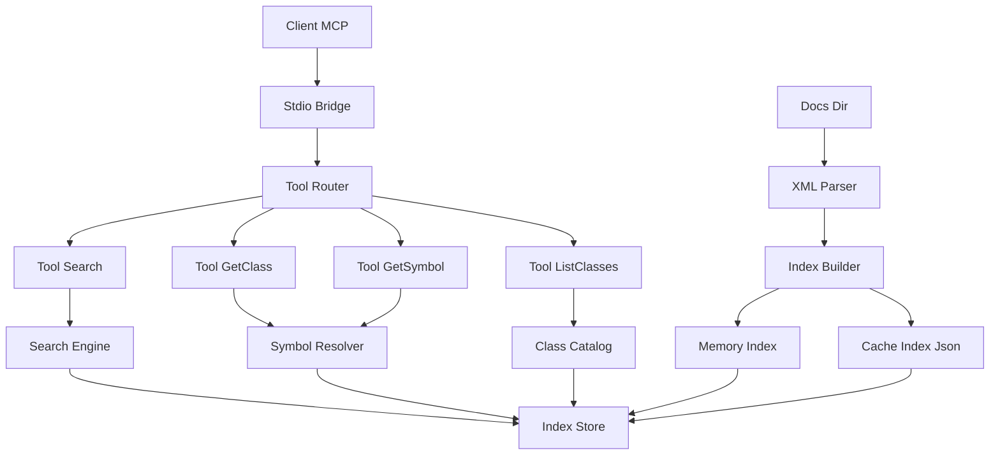
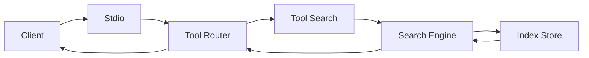
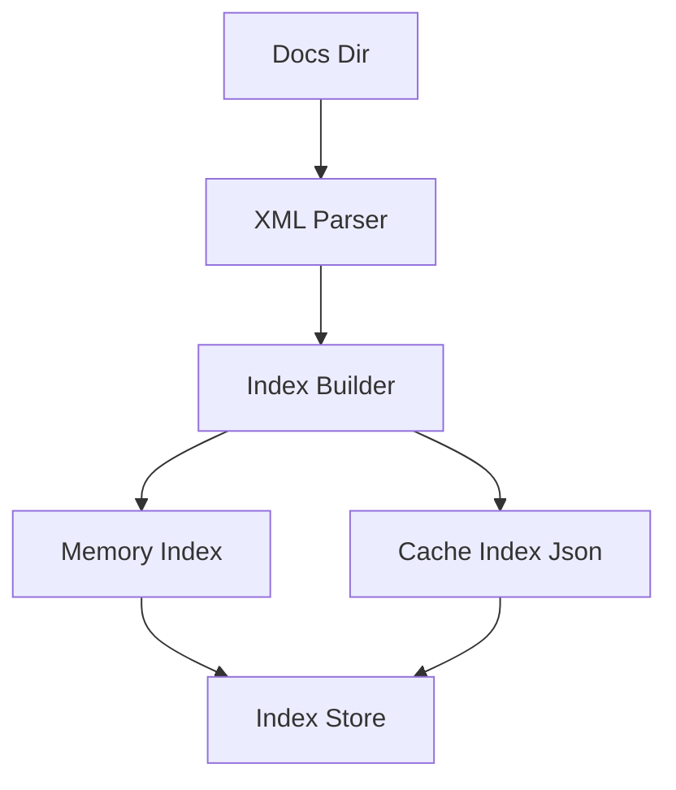

# Technical Design Document

## Overview
本機能は「Godot Docs MCP Server」を実現し、ローカルの Godot API XML ドキュメントから高速な全文検索と正確なシンボル取得を MCP クライアントへ提供する。対象ユーザーはエディタ連携や AI ツールから Godot の API を照会する開発者であり、ネットワークに依存せず即時応答を得ることを目的とする。

本設計は新規機能（グリーンフィールド）として、XML 解析、インメモリ検索、結果の MCP ツール公開という最小限かつ拡張可能な構成を定義する。要件で定義された性能・セキュリティ・一貫した URI 仕様に準拠する。

### Goals
- ローカル XML からの確実なパースと正規化
- p95 応答が要件を満たす検索と取得
- MCP ツール `godot.search`/`godot.get_class`/`godot.get_symbol`/`godot.list_classes` の安定提供

### Non-Goals
- リモートドキュメント取得や同期
- Godot ドキュメントの編集機能
- 一般的な Web 検索や外部インデックス連携

## Architecture

### 高レベルアーキテクチャ
以下は MCP クライアントからの呼び出しと、ローカルドキュメントの解析および検索の関係を示す。



### アーキテクチャ統合
- 既存パターンの維持: 単純なモジュール分割、ESM、型による境界の明確化。
- 新規コンポーネントの理由: XML 専用パーサ、軽量インデックス、MCP ツールアダプタは責務分離とテスト容易性のために必要。
- テクノロジ整合: Node 20 と TypeScript strict、`fast-xml-parser` による堅牢なパース、独自インデックスで外部依存を削減。
- ステアリング適合: リポジトリの AGENTS 方針（ローカルのみ、セキュア、性能目標）に準拠。

### 技術スタックと設計上の主要決定

■ 技術選定
- ランタイム: Node 20, TypeScript strict, ESM。理由: エコシステムと性能、型安全。
- XML パーサ: fast xml parser。理由: エンティティと CDATA への耐性、速度。
- 検索: 独自インメモリ倒置インデックス + BM25 風スコア。理由: 要件内の性能と制御性。
- 永続化: JSON ファイル `.cache/godot-index.json`。理由: シンプルで移植容易。
- テスト: Vitest。理由: 速度と型統合。
- ログ: 薄いラッパ（console もしくは pino）。理由: 依存の最小化。

■ 代替検討
- 検索ライブラリ: Lunr, MiniSearch, FlexSearch。利点: 実装負荷低。欠点: トークナイズやスコア制御の自由度が低下。
- ストア: SQLite, LevelDB。利点: 耐久性と並行性。欠点: 複雑性と起動コスト増。
- パーサ: xml2js。利点: 実績。欠点: パフォーマンスと型付けの明瞭性で劣後。

■ キー設計判断
- 決定: 独自インメモリ倒置インデックスを採用。
  - 文脈: p95 目標とブースト規則を要件通り制御する必要。
  - 代替: Lunr, MiniSearch, FlexSearch。
  - 採択: ドメイン特化トークナイズ（クラス名ブースト）とスコア計算を実装。
  - 根拠: パフォーマンス目標と柔軟性の両立。
  - トレードオフ: 実装負荷と保守責任が増える。
- 決定: JSON 永続化でウォームスタート。
  - 文脈: コールドスタート 3 秒以内の達成と簡易配布。
  - 代替: SQLite, LevelDB。
  - 採択: `.cache/godot-index.json` 読み書き。
  - 根拠: シンプルで移植性が高い。
  - トレードオフ: 破損時の再構築コストは都度発生。
- 決定: XML パース出力を厳密な型に正規化。
  - 文脈: ツールの戻り値スキーマ安定化とテスト容易性。
  - 代替: 動的構造のまま利用。
  - 採択: `GodotClassDoc` と `GodotSymbolDoc` に整形。
  - 根拠: コントラクトの一貫性。
  - トレードオフ: パース時の変換コスト増。

## System Flows

### 検索リクエストの流れ


### インデックス構築フロー


## Components and Interfaces

### Server Layer

#### McpServer
**責務と境界**
- Primary Responsibility: MCP の stdio 入出力とツールディスパッチ。
- Domain Boundary: サーバ層。
- Data Ownership: なし（要求と応答を中継）。
- Transaction Boundary: ツール呼び出し単位。

**依存関係**
- Inbound: MCP クライアント。
- Outbound: GodotTools, Logger。
- External: なし。

**Service Interface**
```typescript
export interface McpServer {
  start(): Promise<void>;
  stop(): Promise<void>;
}
```
- Preconditions: `MCP_STDIO=1`。
- Postconditions: ツールが登録され、stdin stdout が待受状態。
- Invariants: 同期的に共有状態を書き換えない。

### Adapter Layer

#### GodotTools
**責務と境界**
- Primary Responsibility: MCP ツール `godot.search` `godot.get_class` `godot.get_symbol` `godot.list_classes` の公開。
- Domain Boundary: プレゼンテーション境界。
- Data Ownership: なし。
- Transaction Boundary: ツール呼び出し単位。

**依存関係**
- Inbound: McpServer。
- Outbound: SearchEngine, SymbolResolver, ClassCatalog, Logger。
- External: なし。

**Service Interface**
```typescript
export interface GodotTools {
  search(input: { query: string; kind?: 'class'|'method'|'property'|'signal'|'constant'; limit?: number }): Promise<Array<{ uri: string; name: string; kind: string; score: number; snippet?: string }>>;
  getClass(input: { name: string }): Promise<GodotClassDoc>;
  getSymbol(input: { qname: string }): Promise<GodotSymbolDoc>;
  listClasses(input: { prefix?: string; limit?: number }): Promise<string[]>;
}
```
- Preconditions: すべての入力が型制約を満たす。
- Postconditions: 仕様どおりの応答スキーマを返す。
- Invariants: エラーはツールエラーに正規化。

### Domain Layer

#### XmlDocParser
**責務と境界**
- Primary Responsibility: XML を `GodotClassDoc` 群に正規化。
- Domain Boundary: ドキュメント変換。
- Data Ownership: 一時的な中間表現。
- Transaction Boundary: ファイル単位。

**依存関係**
- Inbound: IndexBuilder。
- Outbound: Logger。
- External: fast xml parser。

**Service Interface**
```typescript
export interface XmlDocParser {
  parseAll(dir: string): Promise<GodotClassDoc[]>;
}
```
- Preconditions: `dir/classes` が存在。
- Postconditions: 欠落セクションは空配列で補正。
- Invariants: コード片はテキストとして保持。

#### IndexBuilder
**責務と境界**
- Primary Responsibility: クラスとシンボルから倒置インデックスとドキュメント表を構築し、ブーストを付与。
- Domain Boundary: インデックス構築。
- Data Ownership: メモリ内インデックス、永続化ファイル。
- Transaction Boundary: 全量構築、または差分再構築。

**依存関係**
- Inbound: サーバ起動処理。
- Outbound: IndexStore, Logger。
- External: なし。

**Service Interface**
```typescript
export interface IndexBuilder {
  build(classes: GodotClassDoc[]): Promise<MemoryIndex>;
  persist(path: string, index: MemoryIndex): Promise<void>;
}
```
- Preconditions: クラス配列が非空または空でも許容。
- Postconditions: メモリ内に使用可能なインデックスが存在。
- Invariants: スキーマ互換性を維持。

#### SearchEngine
**責務と境界**
- Primary Responsibility: クエリのトークナイズ、スコアリング、結果整形。
- Domain Boundary: 検索。
- Data Ownership: なし（IndexStore に委譲）。
- Transaction Boundary: クエリ単位。

**依存関係**
- Inbound: GodotTools。
- Outbound: IndexStore, SnippetBuilder, Logger。
- External: なし。

**Service Interface**
```typescript
export interface SearchEngine {
  search(input: { query: string; kind?: 'class'|'method'|'property'|'signal'|'constant'; limit?: number }): Promise<SearchResult[]>;
}
```
- Preconditions: クエリは2文字以上。
- Postconditions: スコア降順で返却、`limit` 適用。
- Invariants: ブースト規則の一貫性。

#### SymbolResolver
**責務と境界**
- Primary Responsibility: `Class.member` から該当シンボルを解決。
- Domain Boundary: 取得。
- Data Ownership: なし。
- Transaction Boundary: リクエスト単位。

**依存関係**
- Inbound: GodotTools。
- Outbound: IndexStore。
- External: なし。

**Service Interface**
```typescript
export interface SymbolResolver {
  getClass(name: string): Promise<GodotClassDoc>;
  getSymbol(qname: string): Promise<GodotSymbolDoc>;
  listClasses(prefix?: string, limit?: number): Promise<string[]>;
}
```
- Preconditions: 引数形式が正当。
- Postconditions: 見つからない場合は `NOT_FOUND` を提示。
- Invariants: クラス名とシンボル名の正規化ルールを保持。

### Infrastructure Layer

#### IndexStore
**責務と境界**
- Primary Responsibility: メモリ内インデックスの提供と JSON へのロード保存。
- Domain Boundary: ストレージ。
- Data Ownership: メモリインデックスと永続ファイル。
- Transaction Boundary: 読み込みと保存の単位。

**依存関係**
- Inbound: SearchEngine, SymbolResolver, ClassCatalog。
- Outbound: ファイルシステム, Logger。
- External: なし。

**Service Interface**
```typescript
export interface IndexStore {
  load(path: string): Promise<MemoryIndex | null>;
  save(path: string, index: MemoryIndex): Promise<void>;
  getIndex(): MemoryIndex;
}
```
- Preconditions: パスは `.cache` または `GODOT_INDEX_PATH`。
- Postconditions: 読み書きの成功または例外の送出。
- Invariants: ファイルは原子的に置換。

#### ClassCatalog
**責務と境界**
- Primary Responsibility: クラス名一覧と前方一致検索。
- Domain Boundary: カタログ。
- Data Ownership: クラス名配列。
- Transaction Boundary: 読み取りのみ。

**Service Interface**
```typescript
export interface ClassCatalog {
  list(prefix?: string, limit?: number): Promise<string[]>;
}
```

#### Logger
```typescript
export interface Logger {
  debug(msg: string, meta?: Record<string, unknown>): void;
  info(msg: string, meta?: Record<string, unknown>): void;
  warn(msg: string, meta?: Record<string, unknown>): void;
  error(msg: string, meta?: Record<string, unknown>): void;
}
```

## Data Models

```typescript
export interface Posting { docId: number; tf: number; }
export interface TermEntry { term: string; postings: Posting[]; df: number; }
export interface DocEntry { id: number; kind: 'class'|'method'|'property'|'signal'|'constant'; name: string; className?: string; brief?: string; description?: string; }
export interface MemoryIndex {
  terms: Map<string, TermEntry>;
  docs: Map<number, DocEntry>;
  byQualified: Map<string, number>;
  byClass: Map<string, number[]>;
  stats: { totalDocs: number; avgDocLen: number };
}

export interface SearchResult { uri: string; name: string; kind: string; score: number; snippet?: string }
```

不変条件:
- `byQualified` は `docs` の id と一対一で整合。
- `avgDocLen` は構築時に固定され、検索時に変更されない。

## Error Handling

### エラーストラテジ
- 入力検証: 形式と必須フィールドを検査し、`INVALID_ARGUMENT` を返す。
- 存在確認: 見つからない場合は `NOT_FOUND` を返す（候補最大5件）。
- 例外捕捉: 予期しない失敗は `INTERNAL` に正規化し、リクエスト識別子で相関付け。

### エラーカテゴリと応答
- User Errors: 400 系の意味合いとして `INVALID_ARGUMENT`、`NOT_FOUND`。
- System Errors: ファイル I O 失敗やパース例外は `INTERNAL`。ログに詳細。

## Security Considerations
- ディレクトリアクセスの制限: 読み取りは `GODOT_DOC_DIR` 内、書き込みは `.cache` または `GODOT_INDEX_PATH` のみ。
- ネットワーク遮断: 実行中はいかなる外部ネットワークも使用しない。
- コード実行の禁止: ドキュメント内のコード片は純テキストとして扱う。
- ウォッチャーが有効な場合: パス正規化とシンボリックリンク検査で外部逸脱を防止。

## Performance and Scalability
- 起動時: ウォームスタートでディスクからインデックス読み込み、なければ 3 秒以内に構築。
- 検索: クエリを正規化し、クラス名完全一致を強ブースト。p95 目標を検証用に計測を埋め込む。
- メモリ管理: 用語表とポスティングの軽量表現、`Map` 使用と文字列インターンでフットプリント削減。
- 並行性: リクエストは読み取り中心でロックレス、再構築は新インデックスにスワップする原子的切替。

## Testing Strategy
- Unit Tests
  - XML パース: CDATA 実体参照、欠落セクションの空配列化。
  - トークナイズ: `Camera3D` → `camera` `3d` `camera3d`。
  - スコアリング: クラス名完全一致ブーストと tf idf の妥当性。
  - シンボル解決: `Node._ready` `Vector2.x` など代表ケース。
- Integration Tests
  - インデックス構築から検索までの一連の流れ。
  - `godot.get_symbol` のエラー `NOT_FOUND` と候補提示。
  - `.cache` 永続化の読み書きと破損時再構築。
- Performance Tests
  - コールドスタート時間計測。
  - 検索 p95 20ms と 60ms の確認。

